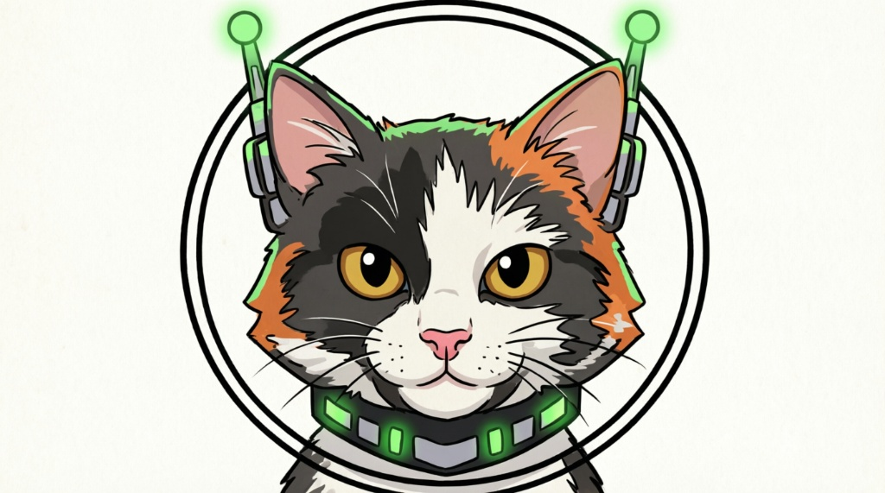

<p align="center">
  
</p>

<h1 align="center">🤖 NoApiBot</h1>

<p align="center">
  <strong>Multi-Agent Orchestration Platform for Telegram</strong><br/>
  29 Specialized AI Agents · 19 Skills · Real-Time Dashboard · Google Workspace Integration
</p>

<p align="center">
  
  
  
  
  
  
</p>

<p align="center">
  <a href="#-quick-start">Quick Start</a> •
  <a href="#-features">Features</a> •
  <a href="#-agent-roster">Agents</a> •
  <a href="#-skill-catalog">Skills</a> •
  <a href="#-dashboard">Dashboard</a> •
  <a href="#-architecture">Architecture</a> •
  <a href="#%EF%B8%8F-configuration">Configuration</a>
</p>

---

## 🚀 Quick Start

```bash
# 1. Clone the repository
git clone https://github.com/yourusername/noapibot.git
cd noapibot

# 2. Install dependencies
pip install -r requirements.txt

# 3. Configure environment
cp .env.example .env
# Edit .env with your Telegram Bot Token and API keys

# 4. Launch
python main.py
```

> The dashboard opens automatically in your browser. Send `/start` in Telegram to begin.

---

## ✨ Features

### 🧠 Multi-Agent Orchestration
NoApiBot is not just a chatbot — it's a **full AI operations center**. An intelligent orchestrator analyzes each request and either handles it directly or delegates to one of 29 specialized agents. Agents can collaborate, chain tasks, and report back through Telegram topic threads.

### 🔧 Tool Execution Engine
The bot has access to a powerful set of native tools that run **locally on your machine**:

| Tool Tag | Description |
|---|---|
| `[CALL_EXEC]` | Execute Python code in a sandboxed, local environment |
| `[CALL_READ]` | Read any local file and return its contents |
| `[CALL_SEARCH]` | Web search via Docker-hosted LLM (Perplexity/SearxNG) |
| `[CALL_PPLX]` | Deep research via local Perplexica (SearxNG) instance |
| `[CALL_MCP]` | Execute Model Context Protocol tools (SQLite, Puppeteer, Filesystem) |
| `[CALL_THINK]` | Delegate complex reasoning to a specialist model (Claude Opus) |
| `[CALL_MSG]` | Delegate tasks to other agents via Telegram topics |

### 💬 Telegram-Native Interface
- **Topic-Based Agents**: Each agent lives in its own Telegram Group topic thread
- **Voice Messages**: Send voice notes → auto-transcription → AI response → TTS reply
- **Photo Analysis**: Send images for AI-powered visual analysis
- **File Processing**: Upload PDFs, DOCX, PPTX, XLSX files for summarization
- **Session Management**: Multiple conversation sessions with persistent memory
- **Reminders**: Schedule time-based reminders with natural language

### 📊 Real-Time Dashboard
A beautiful web dashboard connected via **WebSocket** that shows:
- 🟢 Live agent status (thinking, executing, idle)
- 📈 Token usage and cost metrics per agent
- 📋 Task kanban board with drag-and-drop
- ⏱️ Response time tracking
- 🔄 Auto-refreshing data

### 🌐 Google Workspace Integration
Full integration with Google services via the `gws` CLI:
- **Gmail**: Triage inbox, send emails, search messages
- **Google Drive**: Upload, download, and search files
- **Google Sheets**: Read and write spreadsheet data
- **Google Calendar**: List and create events

### 🐳 Docker Execution Layer
A companion Docker container (`openclaw-container`) provides:
- Isolated code execution environment
- Access to additional LLM engines (OpenCode CLI)
- Multi-model routing (Qwen, Gemini, Claude, Perplexity, DeepSeek)

### ⚡ Model Flexibility
Switch between AI models on the fly with Telegram commands:

| Command | Model |
|---|---|
| `/gemini` | Gemini 3.1 Pro |
| `/flash` | Gemini 3 Flash |
| `/claude_opus` | Claude Opus 4.6 |
| `/claude_sonnet` | Claude Sonnet 4.6 |
| `/perplexity` | Perplexity Sonar Pro |
| `/engine` | Switch between API / OpenCode / Claude engines |

---

## 🤖 Agent Roster

NoApiBot ships with **29 specialized agents**, each with its own personality, toolset, and expertise domain. Agents are assigned to Telegram topics and can be invoked by the orchestrator or directly by the user.

### 🎯 Core Team (Orchestrator's Direct Reports)

| Agent | Role | Specialty |
|---|---|---|
| **🧠 Orchestrator** | Project Director | Analyzes requests, delegates to the right agent, assembles final answers |
| **🔍 Sech** | Research Lead | Real-time research and information synthesis |
| **📡 Argos** | Data Instigator | Deep codebase discovery, architectural analysis, proactive research |
| **⚔️ Cipher** | Backend Architect | Node.js, Python, serverless/edge systems |
| **🎨 Nova** | Frontend Architect | React/Next.js systems with performance focus |
| **🛡️ Aegis** | DevOps & Security | Deployment, CI/CD, server management, production ops |
| **✍️ Neruda** | Master Copywriter | Social media, marketing, persuasive writing |

### 🔧 Engineering Division

| Agent | Specialty |
|---|---|
| **Backend Specialist** | Node.js, Python, serverless architectures |
| **Frontend Specialist** | React, Next.js, performance optimization |
| **Database Architect** | Schema design, query optimization, migrations |
| **Mobile Developer** | React Native, Flutter, cross-platform apps |
| **Game Developer** | PC, Web, Mobile, VR/AR game development |
| **Performance Optimizer** | Profiling, Core Web Vitals, bundle optimization |
| **DevOps Engineer** | Deployment, CI/CD, infrastructure |

### 🔒 Security & Quality

| Agent | Specialty |
|---|---|
| **Security Auditor** | OWASP, vulnerability scanning, security hardening |
| **Penetration Tester** | Offensive security, red team operations |
| **QA Automation Engineer** | Playwright, E2E testing, test infrastructure |
| **Test Engineer** | TDD, test automation, coverage improvement |
| **Debugger** | Root cause analysis, crash investigation |
| **Code Archaeologist** | Legacy code understanding, refactoring |

### 📝 Content & Strategy

| Agent | Specialty |
|---|---|
| **Documentation Writer** | Technical documentation, API docs |
| **SEO Specialist** | SEO audits, GEO optimization, Core Web Vitals |
| **Social Media Publisher** | Multi-platform content distribution (X, YouTube, TikTok, IG) |
| **Product Manager** | Requirements, user stories, acceptance criteria |
| **Project Planner (Ralpf)** | Task breakdown, file structure planning |
| **Narration Editor** | Script editing and narrative refinement |

### 🔬 Research & Discovery

| Agent | Specialty |
|---|---|
| **Explorer Agent** | Codebase discovery, pattern identification |
| **Perplexity Agent** | Direct research via Perplexity models |

---

## 🧩 Skill Catalog

Skills are modular capabilities that enhance the bot's toolset. They are automatically discovered and loaded on startup.

### ⚡ Elite Skills (Slash Commands)

| Skill | Command | Description |
|---|---|---|
| **System Monitor** | `/sysmon` | Real-time CPU, RAM, Disk, and Network metrics |
| **Browser Vision** | `/vision <url>` | Navigate to URLs and capture visual screenshots |
| **Git Essentials** | `/git <cmd>` | Git operations from Telegram |
| **Directory Tree** | `/tree <dir>` | Generate directory structure maps |
| **Python Runner** | `/runscript <path>` | Execute Python scripts remotely |
| **API Tester** | `/api <method> <url>` | Test HTTP APIs with curl-like simplicity |
| **Docker Manager** | `/docker <cmd>` | Manage Docker containers |
| **Code Linter** | `/lint <path>` | Lint Python/JS files for code quality |
| **Google Workspace** | `/gmail`, `/drive`, `/sheets`, `/calendar` | Full Google suite integration |
| **LinkedIn Publisher** | `/linkedin <topic>` | Generate and publish LinkedIn content |
| **Workspace Search** | `/search <dir> <term>` | Search across local project files |
| **MCP Client** | `/mcp <server> <tool>` | Access Model Context Protocol servers |
| **Task Status** | *(internal)* | Report task progress to the dashboard |

### 🎭 Persona Skills (Prompt Injectors)

| Skill | Effect |
|---|---|
| **Coder** | Enhanced coding mode with strict best practices |
| **Perplexity** | Research-first behavior with citation formatting |
| **Resumen** | Ultra-concise summarization mode |
| **Traductor** | Professional translation mode |

---

## 📊 Dashboard

The NoApiBot Dashboard is a single-page web application that connects to the bot via WebSocket for real-time monitoring.

**Key Features:**
- 🟢 Live status indicators per agent
- 📋 Kanban-style task board
- 📈 Token usage metrics with cost tracking
- 🔄 Auto-refreshing every 5 seconds
- 🌙 Dark mode by default

**Access:**
- Auto-opens on bot startup (configurable)
- Open anytime via `/dashboard` command in Telegram
- Direct access: open `dashboard/index.html` in any browser

---

## 🏗️ Architecture

```
┌─────────────────────────────────────────────────────────┐
│                    Telegram Group                        │
│  ┌──────┐ ┌──────┐ ┌──────┐ ┌──────┐ ┌──────┐          │
│  │Topic1│ │Topic2│ │Topic3│ │Topic4│ │Topic5│  ...      │
│  │Sech  │ │Cipher│ │Nova  │ │Aegis │ │Neruda│          │
│  └──┬───┘ └──┬───┘ └──┬───┘ └──┬───┘ └──┬───┘          │
└─────┼────────┼────────┼────────┼────────┼───────────────┘
      │        │        │        │        │
      ▼        ▼        ▼        ▼        ▼
┌─────────────────────────────────────────────────────────┐
│              NoApiBot v4.0 (Python)                      │
│  ┌───────────┐  ┌───────────┐  ┌───────────────────┐    │
│  │ Orchestr. │──│ Core.py   │──│ Tool Registry     │    │
│  │ (bot.py)  │  │ (LLM Hub) │  │ CALL_EXEC/READ/   │    │
│  └───────────┘  └─────┬─────┘  │ SEARCH/MCP/THINK  │    │
│                       │        └───────────────────┘    │
│  ┌────────┐  ┌────────┴────┐  ┌──────────────────┐     │
│  │Memory  │  │ Handlers    │  │ WebSocket Server │     │
│  │Sessions│  │ 7 modules   │  │ ws://localhost    │     │
│  │Persona │  │             │  │ :8765             │     │
│  └────────┘  └─────────────┘  └────────┬─────────┘     │
└─────────────────────────────────────────┼───────────────┘
                                          │
      ┌───────────────────────────────────┼──────────┐
      │          Dashboard (HTML/JS)      │          │
      │          Real-time Monitoring     ▼          │
      │          Task Board · Metrics · Status       │
      └──────────────────────────────────────────────┘
                          │
      ┌───────────────────┼──────────────────────────┐
      │    Docker Container (openclaw-container)      │
      │    OpenCode CLI · Multi-Model Router          │
      │    Qwen · Gemini · Claude · Perplexity        │
      └──────────────────────────────────────────────┘
```

---

## 📁 Project Structure

```
noapibot/
├── __init__.py          # Package version (v4.0.0)
├── config.py            # Centralized configuration & env vars
├── state.py             # Shared runtime state (model, engine, skills)
├── memory.py            # Sessions, QMD summaries, persona, reminders
├── core.py              # LLM orchestration engine (tool interception loop)
├── tools.py             # CALL_* tool registry & execution
├── tts.py               # Edge TTS voice synthesis
├── websocket.py         # Dashboard WebSocket server
├── bot.py               # Telegram handler registration & startup
└── handlers/
    ├── basic.py         # /start, models, memory, sessions, /exec, /dashboard
    ├── files.py         # /read, /save, /pdf, /docx, /pptx, /xlsx
    ├── media.py         # Voice transcription, photo analysis, /habla
    ├── search.py        # /search, /deep, /trending
    ├── skills.py        # Elite skills system & /use toggle
    ├── gws.py           # Google Workspace commands
    └── advanced.py      # /auto, /mcp, engine switching, /claude

data/
├── agents/              # 29 agent definition files (.md)
├── skills/              # 15 elite skills + 4 persona skills
└── (runtime files)      # sessions/, persona.txt, memory.json

dashboard/
└── index.html           # Real-time monitoring UI

assets/
└── logo.jpg             # NoApiBot logo
```

---

## ⚙️ Configuration

All configuration is done via environment variables in `.env`:

```bash
# Required
TELEGRAM_BOT_TOKEN=your_bot_token
ANTIGRAVITY_API_KEY=your_gemini_api_key

# Optional
PERPLEXITY_API_KEY=your_perplexity_key
BRAVE_API_KEY=your_brave_key

# Customization
NOAPIBOT_DEFAULT_MODEL=qwen3.5-plus    # Default AI model
NOAPIBOT_DEFAULT_ENGINE=api             # api | opencode | claude
NOAPIBOT_MAX_CONTEXT=20                 # Messages in context window
NOAPIBOT_EXEC_TIMEOUT=30                # Script execution timeout (sec)
NOAPIBOT_AUTO_OPEN_DASHBOARD=true       # Auto-open dashboard on start
```

---

## 🐳 Docker Setup (Optional)

For the full multi-model experience with isolated code execution:

```bash
# Build the container
docker build -t openclaw-openclaw .

# Start with Docker Compose
docker-compose up -d
```

This enables:
- Sandboxed code execution via `/exec`
- Multi-model routing (Qwen, DeepSeek, Claude, Perplexity)
- Isolated workspace for file operations

---

## 📜 Telegram Commands Reference

<details>
<summary><strong>📋 Click to expand full command list</strong></summary>

### Core
| Command | Description |
|---|---|
| `/start` | Show welcome message and command menu |
| `/dashboard` | Open the monitoring dashboard |
| `/statusbot` | Show current bot status and configuration |
| `/resetbot` | Restart the bot's internal state |

### Models
| Command | Description |
|---|---|
| `/models` | List all available AI models |
| `/gemini <model>` | Switch to a Gemini model |
| `/flash` | Switch to Gemini Flash (fast) |
| `/claude_opus` | Switch to Claude Opus (powerful) |
| `/claude_sonnet` | Switch to Claude Sonnet (balanced) |
| `/perplexity` | Switch to Perplexity Sonar |
| `/engine <name>` | Switch execution engine (api/opencode/claude) |

### Memory & Persona
| Command | Description |
|---|---|
| `/memory` | Show current conversation memory |
| `/qmd` | Generate a Quick Memory Digest (summary) |
| `/forget` | Clear current session memory |
| `/persona` | Show current persona configuration |
| `/set_persona <text>` | Set a custom persona |
| `/agent <name>` | Switch to a specific agent personality |
| `/reset_persona` | Reset to default persona |

### Sessions
| Command | Description |
|---|---|
| `/new <name>` | Create a new conversation session |
| `/sessions` | List all saved sessions |
| `/switch <name>` | Switch to a different session |
| `/bind <agent>` | Bind an agent to the current topic |

### Files
| Command | Description |
|---|---|
| `/read <path>` | Read a local file |
| `/save <path>` | Save content to a file |
| `/pdf <path>` | Summarize a PDF |
| `/docx <path>` | Summarize a Word document |
| `/pptx <path>` | Summarize a PowerPoint |
| `/xlsx <path>` | Summarize an Excel spreadsheet |

### Google Workspace
| Command | Description |
|---|---|
| `/gmail <action>` | Gmail operations (triage, send, search) |
| `/drive <action>` | Google Drive operations |
| `/sheets <action>` | Google Sheets operations |
| `/calendar <action>` | Google Calendar operations |
| `/keep <action>` | Google Keep operations |

### Search & Research
| Command | Description |
|---|---|
| `/search <query>` | Quick web search |
| `/deep <query>` | Deep research with multiple sources |
| `/trending` | Show current trending topics |

### Skills
| Command | Description |
|---|---|
| `/skills` | List all available skills |
| `/use <name>` | Toggle a persona skill on/off |
| `/sysmon` | System monitoring dashboard |
| `/git <cmd>` | Git operations |
| `/tree <dir>` | Directory tree view |
| `/exec <cmd>` | Execute a command in Docker |
| `/lint <path>` | Lint code files |
| `/cv <data>` | Generate an ATS-optimized CV |
| `/linkedin <topic>` | Generate a LinkedIn post |

### Media
| Command | Description |
|---|---|
| `/habla <text>` | Text-to-speech (generates audio) |
| `/hablame` | Reply to a message with TTS |
| 🎤 *Voice message* | Auto-transcribe and respond |
| 📷 *Photo* | Analyze image content |

### Advanced
| Command | Description |
|---|---|
| `/mcp <server> <tool> <args>` | Execute MCP tool |
| `/mcps` | List available MCP servers |
| `/auto <task>` | Autonomous multi-step task execution |
| `/claude <prompt>` | Direct Claude CLI query |
| `/usage` | Show API usage statistics |

</details>

---

## 🤝 Contributing

Contributions are welcome! Please feel free to submit a Pull Request.

1. Fork the repository
2. Create your feature branch (`git checkout -b feature/amazing-feature`)
3. Commit your changes (`git commit -m 'Add amazing feature'`)
4. Push to the branch (`git push origin feature/amazing-feature`)
5. Open a Pull Request

---

## 📄 License

This project is licensed under the MIT License — see the [LICENSE](LICENSE) file for details.

---

<p align="center">
  <strong>Built with 🧠 by Jerome Francois</strong><br/>
  <em>Made in 🇩🇴 Dominican Republic</em>
</p>
